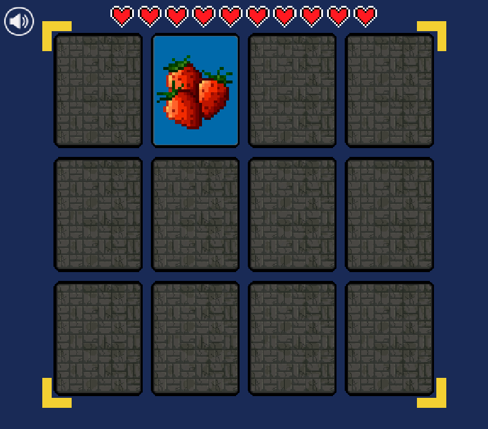

# Word Match Game

This is a simple word matching game. The goal is to match all the cards in the fewest number of moves.

Click on a card to select it. Click on a second card to match it. If the words match, the cards will remain disappear. If the symbols do not match, the cards will be deselected. Continue until all cards are matched.

## Instructions

1. Clone the repository.
2. Install dependencies with `npm install`.
3. Start the development server with `npm run dev`.
4. If you want to build the project, run `npm run build`.

